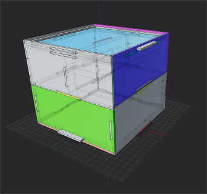
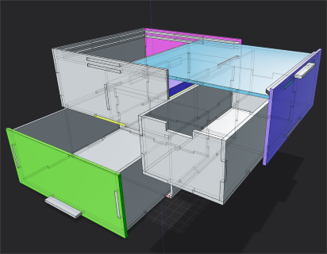
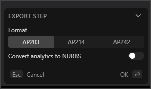
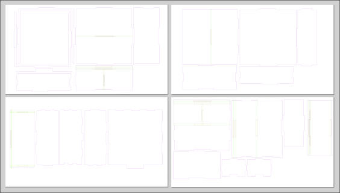
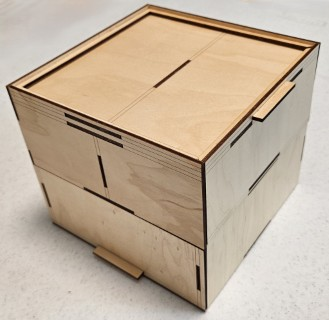
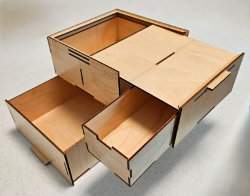

# Plasticity-LaserConvert
LaserConvert is a .NET tool that reads STP CAD files, detects the thin (≈ 3 mm) extrusion axis, rotates each solid into its footprint plane, and outputs clean 2D SVG outlines for laser cutting.

---

### Installation and Use
Clone this repository
Install .NET 10 SDK (if not already installed)
Build the project using `dotnet build` (or use Visual Studio)
In Plasticity, build your model out of solids all approximately 3 mm thick, then export as STEP.
Run the tool with `LaserConvert.exe <input.stp> <output.svg>`

### TO-DO
- [ ] Add command-line options for customizing output (e.g., material thickness)
- [ ] convert from a CLI to a .NET library and then add a Blazor wrapper so it can be used by anyone in a static website

### Click for larger images

  

  

  

  
   (Layout and some decoration lines added in Inkscape)

  

  